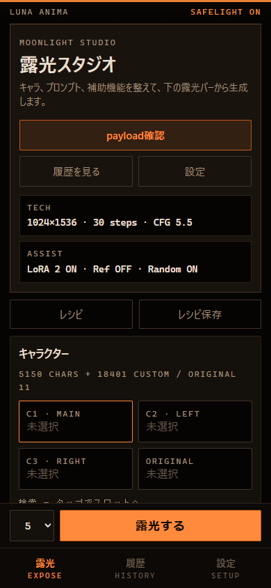
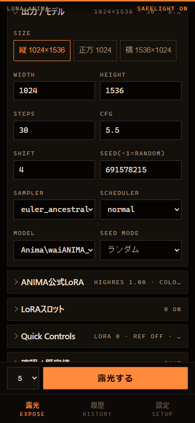
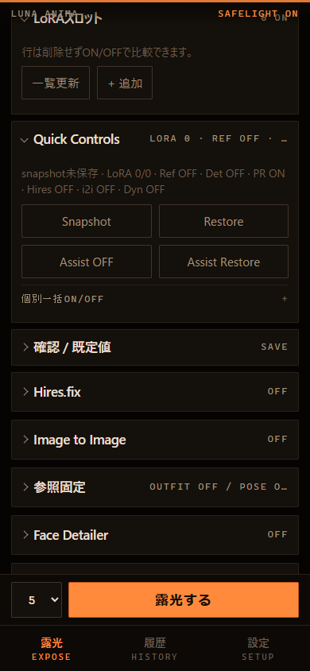
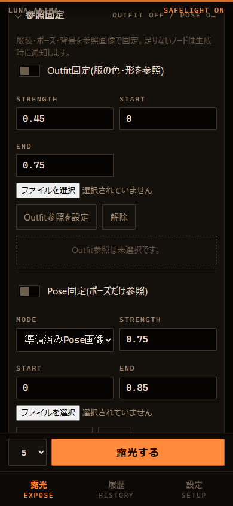
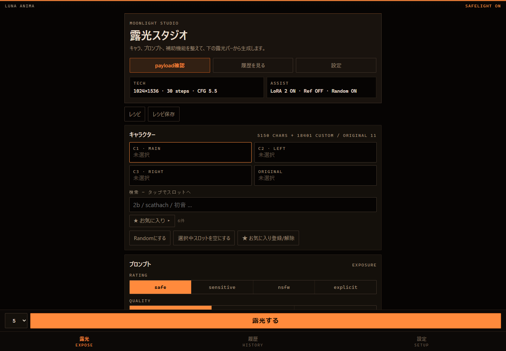
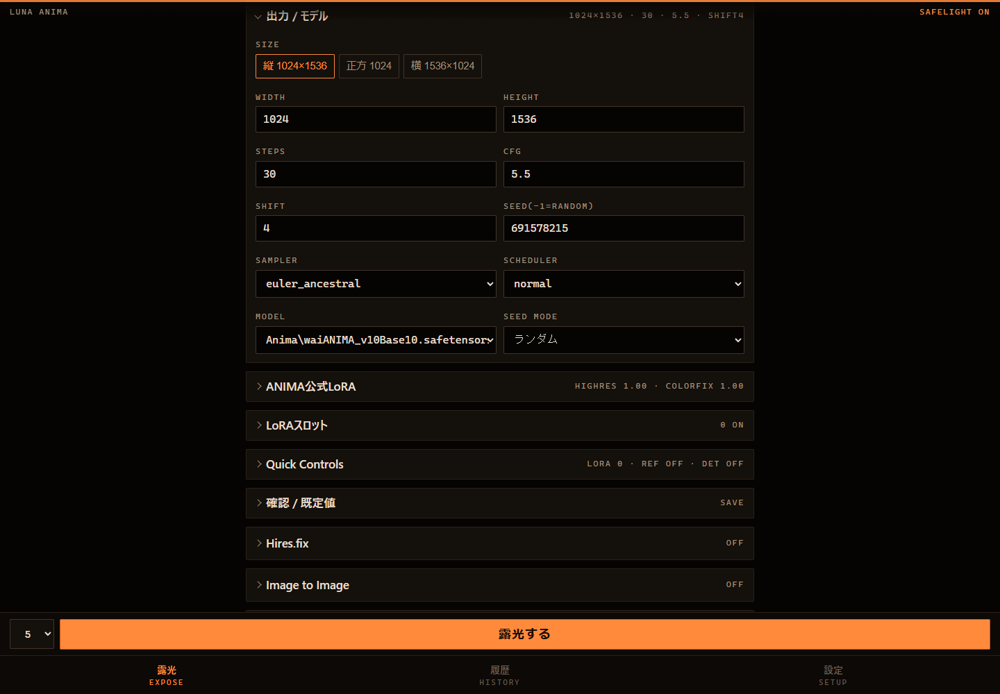
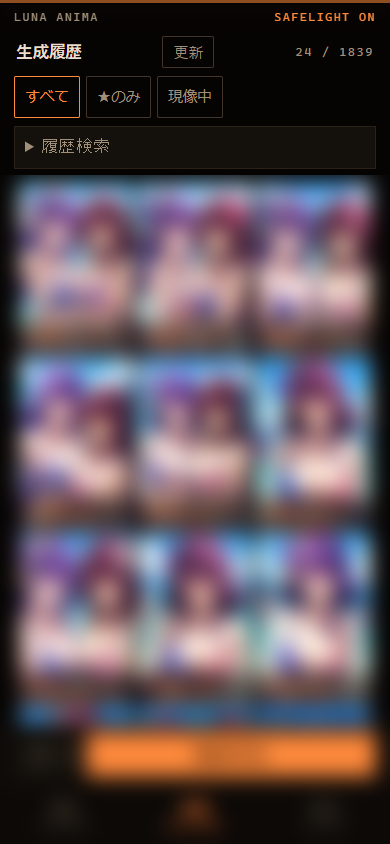
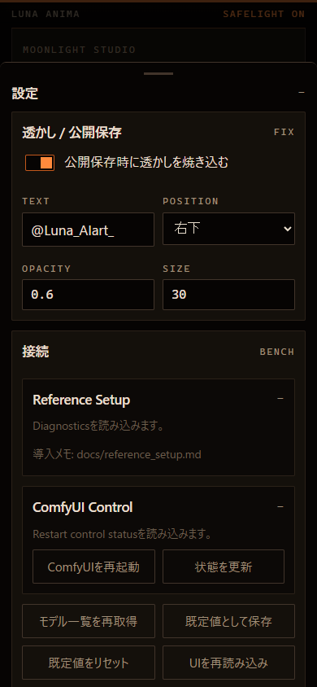

# PR43 Compact Generation Settings

## UX Measurement

Measured with Chrome/Playwright at `390x844` and `1440x1000`.

| State | scrollHeight | ratio | LoRA Y | Reference Y | Detailer Y | horizontal |
| --- | ---: | ---: | ---: | ---: | ---: | --- |
| Mobile before, tech open | 3483 | 4.13 | 2696 | 3169 | 3229 | no |
| Mobile after, output/model open | 2905 | 3.44 | 2309 | 2591 | 2651 | no |
| Desktop before, tech open | 3035 | 3.04 | 2364 | 2725 | 2785 | no |
| Desktop after, output/model open | 2672 | 2.67 | 2074 | 2362 | 2422 | no |

Closed mobile page height increased from `2209` to `2419` because the large technical fold was split into visible top-level groups. The tradeoff is intentional: users can reach Official LoRA, LoRA Slots, Quick Controls, Reference, and Detailer without opening one long technical tray.

## Information Architecture

- Kept the PR42 studio hero, primary Payload Preview, and sticky Generate flow.
- Split the previous technical tray into `Output / Model`, `ANIMA official LoRA`, `LoRA Slots`, `Quick Controls`, and `Confirm / Defaults`.
- Moved only low-frequency controls behind the new compact details; all existing inputs, IDs, and data-actions remain.
- Kept Quick Controls primary actions visible while moving per-feature bulk ON/OFF into a small nested fold.
- Left Reference, i2i, Hires.fix, and Detailers as top-level folds so their summaries remain scannable.

## Screenshots

### Mobile Top

Before:

After:

### Mobile Technical Settings

Before:

After:

### Mobile LoRA and Reference

### Desktop

Before:

After:

### Sheets

History thumbnails are blurred for review safety.

