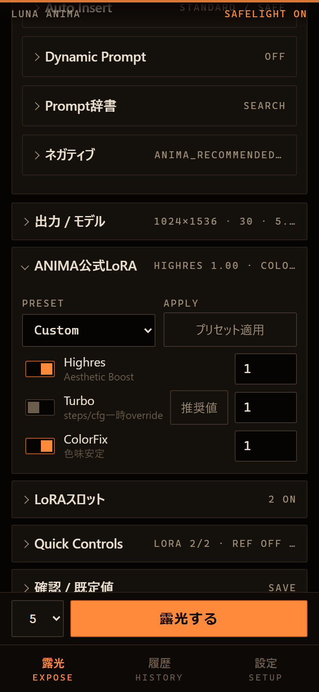
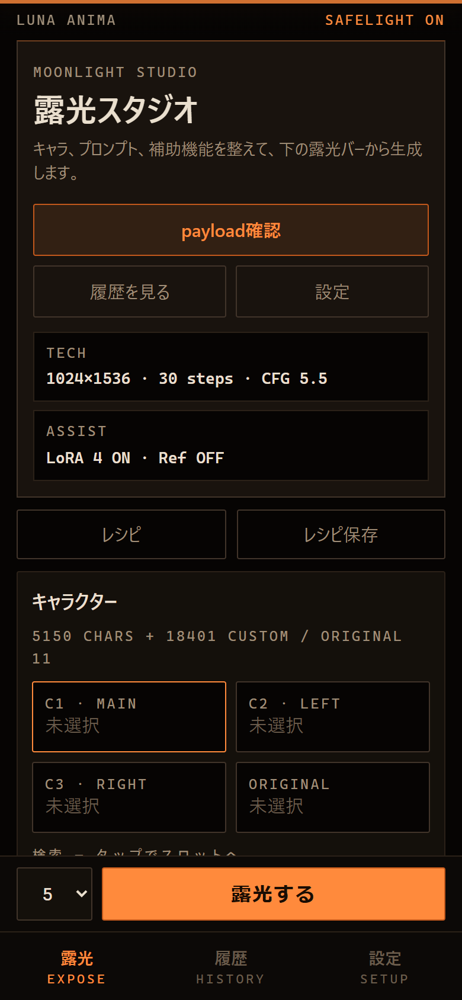
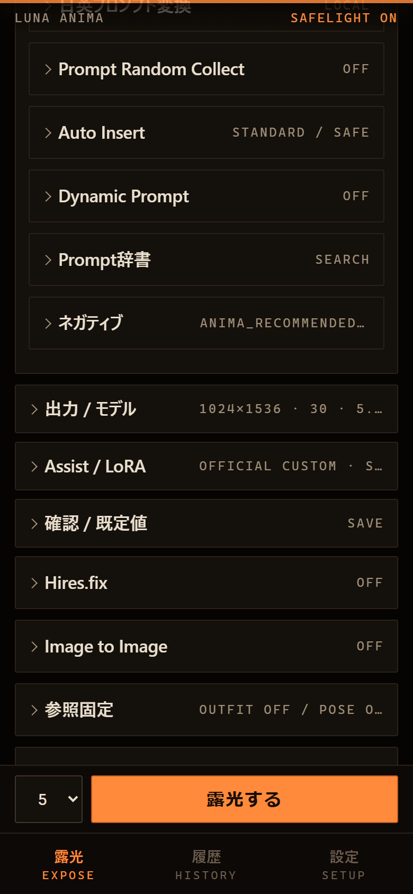
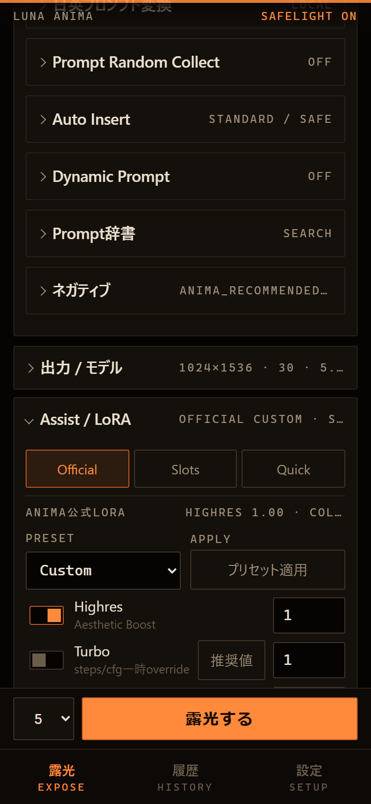
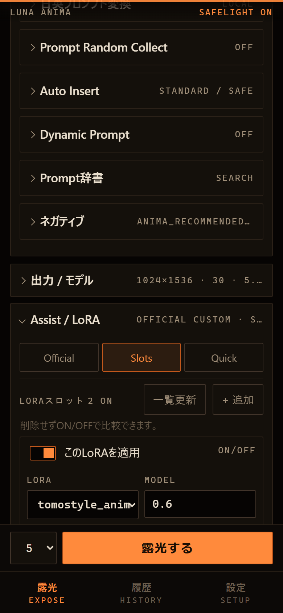
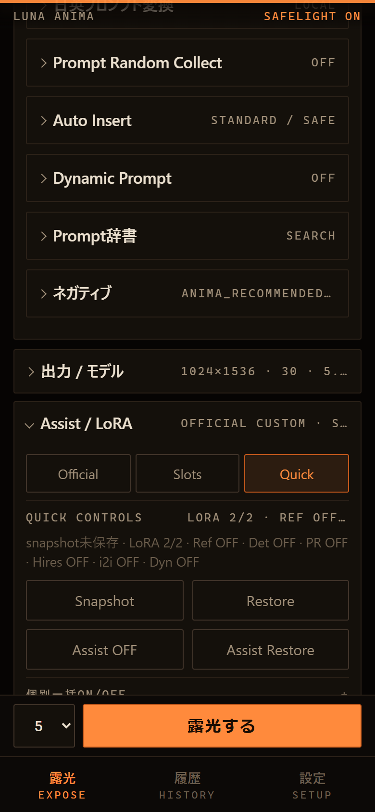
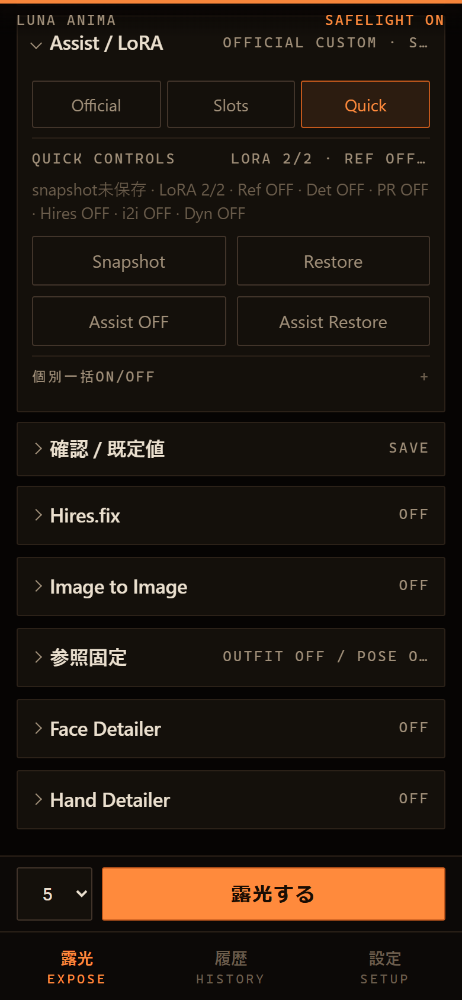
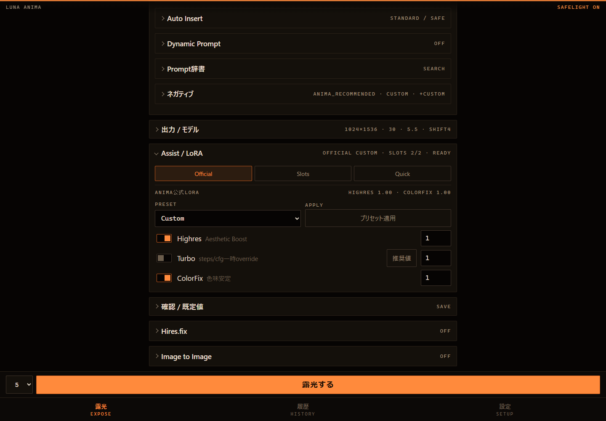
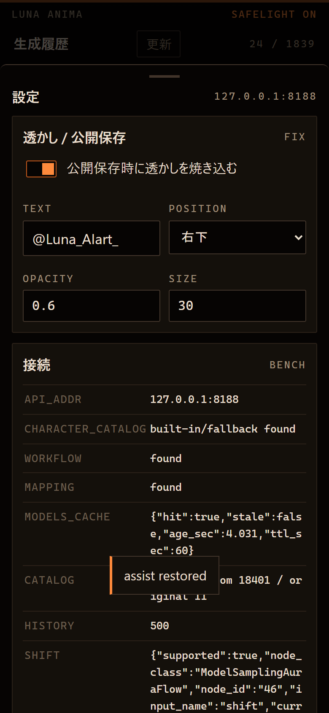

# PR44 Assist Hub UI Notes

## UX Audit

- PR43 improved the open technical settings height, but mobile closed state still had 10 top-level generation setting trays.
- Official LoRA, LoRA Slots, and Quick Controls were adjacent but separate; this made the page feel longer before Reference and Detailer.
- The main opportunity was to consolidate related assist controls without removing existing IDs, actions, or payload behavior.

## Scroll Metrics

Measured with Playwright at 390x844 mobile and 1440x1000 desktop.

| Metric | Mobile before | Mobile after | Desktop before | Desktop after |
| --- | ---: | ---: | ---: | ---: |
| scrollHeight | 2419 | 2311 | 2193 | 2081 |
| clientHeight | 844 | 844 | 1000 | 1000 |
| ratio | 2.87 | 2.74 | 2.19 | 2.08 |
| top-level details | 10 | 8 | 10 | 8 |
| Output / Model Y | 1715 | 1715 | 1483 | 1483 |
| Assist / Official Y | 1769 | 1769 | 1539 | 1539 |
| LoRA Slots Y | 1823 | 1769 | 1595 | 1539 |
| Quick Controls Y | 1877 | 1769 | 1651 | 1539 |
| Reference Y | 2105 | 1997 | 1883 | 1771 |
| Detailer Y | 2165 | 2057 | 1943 | 1831 |
| horizontal scroll | no | no | no | no |

## Changes

- Consolidated ANIMA Official LoRA, LoRA Slots, and Quick Controls into one `Assist / LoRA` top-level tray.
- Added session-only Assist Hub tabs: Official, Slots, Quick.
- Preserved all existing form IDs and data-action values inside the new hub.
- Added `assistHubSummary` so the closed tray still shows official preset, LoRA slot count, and active assist state.
- Kept Reference / i2i / Detailer as separate areas for this PR; they can be hubbed in a later polish pass.

## Screenshots

- 
- 
- 
- 
- 
- 
- 
- 
- 
- 
- 

## Final Visual Check

- Mobile 390px has no horizontal scroll.
- The primary Assist controls remain reachable under one tray.
- Official LoRA, LoRA Slots, and Quick Controls keep their existing controls and state while switching tabs.
- History and Settings sheets still render without obvious layout regressions.
